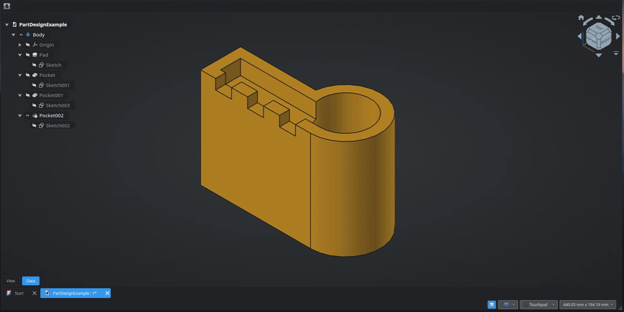

# Molding Wizard for FreeCAD

This is a molding wizard for FreeCAD. I created it (with an LMM) as I was needing to make tens of molds at work for a project, and preferred to automate the mold design part.

1. Open the Molding Wizard task panel
1. Select a model
1. Define a pull direction
1. Define the mold split
1. Choose the mold shape
1. Choose the filling method
1. Optionally add an overflow gutter
1. Optionally add vents
1. Optionally add registration keys
1. Optionally add clamping hardware holes
1. Optionally add pry slots
1. Optionally add text embossments to label molds

Creates an object in the tree with 2 bodies in it, one for each side of the mold.
You can edit the mold in the task panel or in the property view.

---

This tool is very new. Let me know if it helped you out! If you have a feature idea, please feel free to submit an issue.

Cheers
